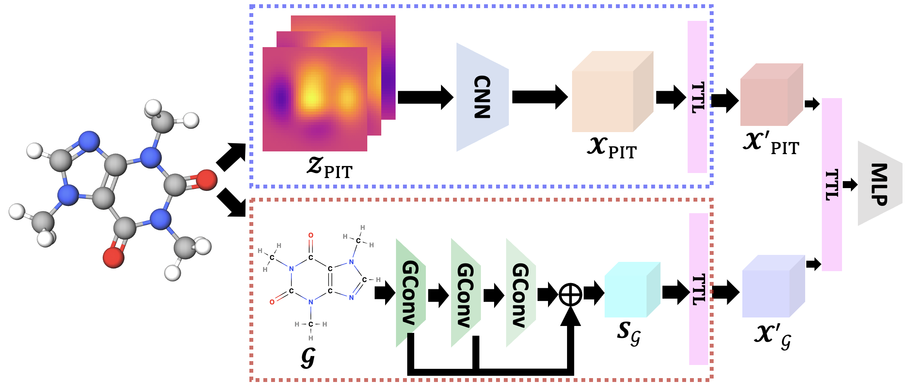

# TTG-NN
The PyTorch implementation of TTG-NN (**Tensor-view Topological Graph Neural Network**) published @ AISTATS-24.
[\[arXiv\]](https://arxiv.org/abs/2401.12007) 

## Method
This work proposes two tensor-based graph representation learning schemes, i.e., Tensor-view Topological Convolutional Layers (TT-CL) and Tensor-view Graph Convolutional Layers (TG-CL). It first produces topological and structural feature tensors of graphs as tensors by using multi-filtrations and graph convolutions respectively. Then, it utilizes TT-CL and TG-CL to learn hidden local and global topological representations of graphs. It further designs a module of Tensor Transformation Layers (TTL) which employs tensor low-rank decomposition to address the model complexity and computation issues.



## Requirements
Python 3.10, torch 2.0.0, gudhi 3.7.1, tensorly-torch 0.4.0, networkx 3.0, numpy 1.24.2, scipy 1.10.1, scikit-learn 1.2.2.

Warning: Don't set hidden_dim too large for TRL (4 is recommended).

## Citation
If you find this repository useful in your research, please consider giving a star :star: and a citation
```
@misc{wen2024tensorview,
      title={Tensor-view Topological Graph Neural Network}, 
      author={Tao Wen and Elynn Chen and Yuzhou Chen},
      year={2024},
      eprint={2401.12007},
      archivePrefix={arXiv},
      primaryClass={cs.LG}
}
```
